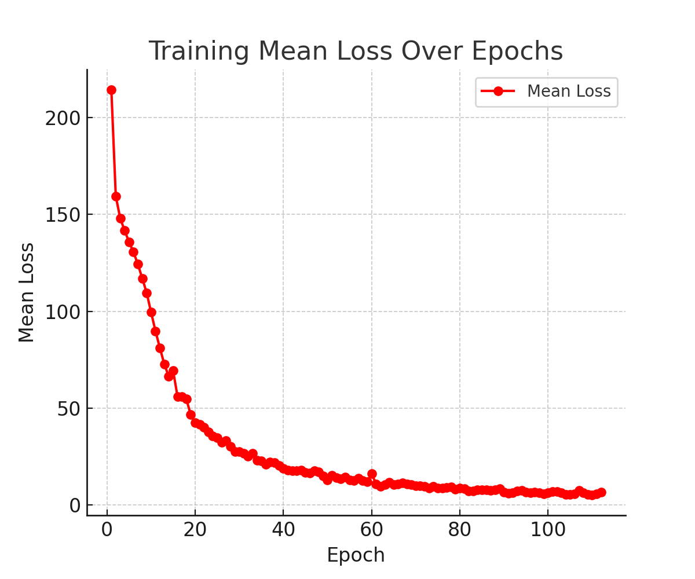
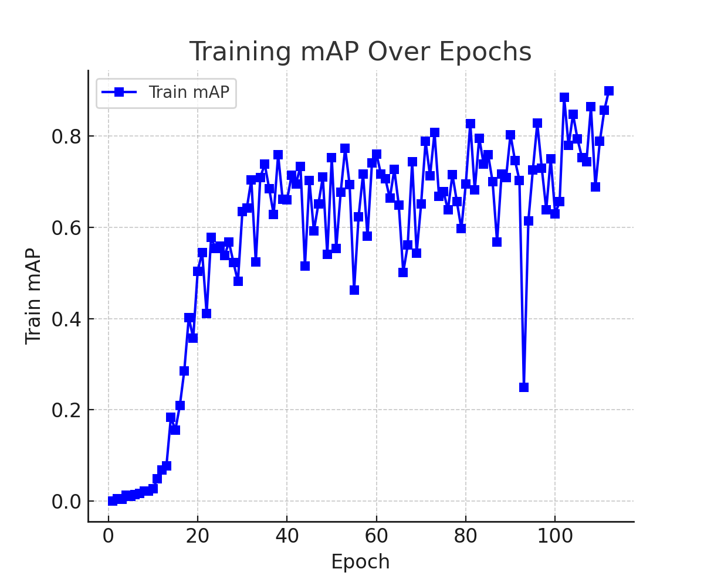
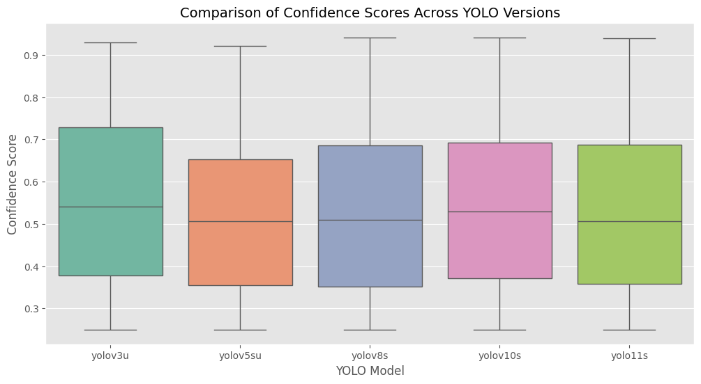
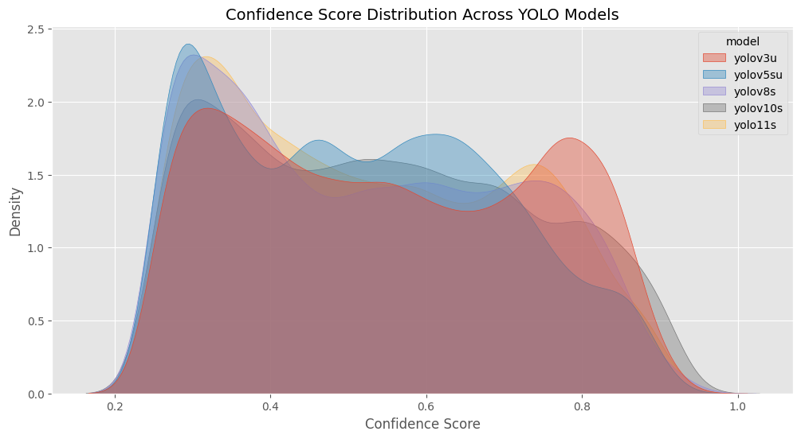

# Implementation of YOLOv1 and comparaison between models


## YOLOv1 Implementation Folder Architecture & Key Differences


This project is organized into several key components, each handling a specific part of the YOLOv1 pipeline for object detection. The architecture follows the structure of a typical deep learning object detection project, but with additional modularity and clarity. Here’s an overview of the folder structure:
```
project/
│
├── dataset.py       # Contains the custom Dataset class for loading and preprocessing data
├── model.py         # Defines the YOLOv1 architecture (with BatchNorm modifications)
├── loss.py          # Implements the YOLOv1 loss function
├── train.py         # Main training script
└── utils.py         # Helper functions for operations like NMS, mAP calculation, and more
```

1. dataset.py

    Contains the VOCDataset class, which is a custom implementation of a PyTorch dataset that loads the Pascal VOC dataset.
    The dataset reads image files and their corresponding label files, converting them into a grid-based format for YOLO.
    The class handles the conversion of bounding boxes into a matrix format (S x S x (C + 5 * B)) required by YOLO.
    The Compose class is used to sequentially apply image transformations like resizing and tensor conversion.

2. model.py

    This file defines the YOLOv1 architecture in the Yolov1 class.
    The architecture is slightly modified from the original YOLOv1 by adding Batch Normalization layers to improve training stability and convergence.
    The model consists of several convolutional layers followed by fully connected layers.
    The convolutional layers are created using blocks (CNNBlock) consisting of a convolution followed by Batch Normalization and LeakyReLU activation.

3. loss.py

    Implements the YOLOv1 loss function (YoloLoss class).
    This class calculates the total loss by combining multiple components: box coordinate loss, object confidence loss, no-object loss, and classification loss.
    The loss function also handles the intersection over union (IoU) for bounding box matching and scales the individual loss components according to the YOLOv1 paper’s original lambda values (lambda_coord = 5 and lambda_noobj = 0.5).

4. train.py

    The main script for training the YOLOv1 model.
    It initializes the model, optimizer (Adam), and loss function, and loads the Pascal VOC dataset.
    The script trains the model for a specified number of epochs and computes the mean average precision (mAP) on the training set.
    It also includes code for saving and loading model checkpoints periodically during training.

5. utils.py

    Contains helper functions like:
        non_max_suppression: Removes redundant bounding boxes by applying NMS.
        mean_average_precision: Computes the mAP based on predicted and ground truth bounding boxes.
        get_bboxes: Retrieves the predicted and true bounding boxes from the dataset.
        save_checkpoint & load_checkpoint: Functions to save and load model checkpoints.

Key Differences with the Original YOLOv1 Model

While the overall architecture closely follows the YOLOv1 design as described in the original paper, a few modifications have been made to improve the model's performance and stability. The main differences are:

1. Batch Normalization (BatchNorm)

    Original Model: YOLOv1 used regular convolutional layers followed by LeakyReLU activations without any normalization techniques.\
    Modified Model: The CNNBlock class in model.py introduces Batch Normalization after each convolutional layer. This helps stabilize the training process by normalizing the output of each layer and mitigating issues related to internal covariate shifts. Batch normalization also allows the use of higher learning rates and accelerates convergence.

2. Architecture Overview

    Original Model: YOLOv1 uses a series of convolutional layers followed by fully connected layers. The input image is processed through a 7x7 grid, where each grid cell predicts bounding boxes and class probabilities.\
    Modified Model: The architecture remains largely unchanged, but with the added BatchNorm layers in the convolutional blocks. Additionally, the fully connected layers at the end of the model are modified to output predictions for bounding box coordinates and class probabilities. We also put less parameters. The overall layout includes:
        Convolutional layers: These layers extract feature maps from the input image.
        Fully connected layers: The output of the convolutional layers is flattened and passed through dense layers to predict bounding boxes and class scores.

3. Training Adjustments

    Original Model: YOLOv1 used SGD with momentum as the optimizer.\
    Modified Model: The optimizer in train.py is set to Adam for better convergence, as Adam is often more efficient for training deep networks, especially with the addition of BatchNorm.
    Loss Function: The YoloLoss class closely follows the loss function presented in the original YOLOv1 paper. The loss is a combination of:
        Coordinate loss for bounding box localization.
        Object loss for confidence in the presence of objects.
        No-object loss for the confidence of grid cells without objects.
        Class loss for predicting the correct class.

4. Data Augmentation & Preprocessing

    Original Model: The original YOLOv1 paper did not focus much on data augmentation strategies.\
    Modified Model: In this implementation, basic resize and tensor conversion transforms are applied to the images using the Compose class. Further augmentation could be added to improve generalization, such as random cropping, flipping, or color jittering


### Summary of Changes and Improvements


Batch Normalization was introduced to the convolutional blocks to improve training stability and speed up convergence, this was orginally added in YOLOv2.
Adam Optimizer was used instead of SGD for more efficient training, especially with the additional normalization.
The architecture follows the original YOLOv1 design but improves it with clearer modularization and optimizations like BatchNorm.
The training script (train.py) was set up to train the model over multiple epochs, with the ability to compute mAP and save/load checkpoints.
The dataset pipeline was customized to load the Pascal VOC data and format it according to the YOLOv1 model’s requirements.

### Conclusion:

This implementation keeps the core ideas of YOLOv1 intact while enhancing the model’s performance with Batch Normalization and using Adam as the optimizer. The project is modular and can easily be extended with more advanced data augmentation or modified loss functions. It also includes utilities for evaluating the model with mAP and saving/loading checkpoints, ensuring that the training process is robust and reproducible.


### Results of the YOLOv1 model

The model was trained on the VOC2007 dataset, it gives poor performance as we only trained on 100 epochs and the model is not that deep. 

[](figures/mean_loss_plot.png)


[](figures/train_map_plot.png)

As we can see the train map is not that good and the model is not that good at detecting objects.

And the model overfit largely, in `yolo_results` you can find the weights of the model and the results of the detection on some images.


## Comparaison between models


We tested different YOLO models (YOLOv3, YOLOv5s, YOLOv8s, YOLOv10s, and YOLOv11s) on multiple videos. The results are stored in Google Drive under the `yolo_results` folder. Each model has its own subfolder inside `yolo_results/`, where the processed videos are saved.

The drive link : [yolo_results](https://drive.google.com/drive/folders/182cOvRUrO95PkGC5n5irTxV3SnqeVSyl?usp=drive_link "yolo_results")

The drive folder is organized as follows:

- **yolo_results/yolov3u/** → Contains videos processed with YOLOv3.
- **yolo_results/yolov5su/** → Contains videos processed with YOLOv5s.
- **yolo_results/yolov8s/** → Contains videos processed with YOLOv8s.
- **yolo_results/yolov10s/** → Contains videos processed with YOLOv10s.
- **yolo_results/yolo11s/** → Contains videos processed with YOLOv11s.

Each folder contains the same set of videos but processed with the respective YOLO model. The filenames correspond to the original videos, and the detections are embedded in the output videos.

Additionally, comparison videos that merge the results from all YOLO models into a single frame are stored in the `yolo_results/yolo_comparisons/` folder in Google Drive. These videos allow visual comparison of the different models' performances side by side.
The comparaison start from yolov3 from top left to yolov11s in the bottom right.

Basically the videos are :

- **bird.mp4** → A video of a bird flying in the sky with a clear background and in daylight.
- **Highspeed2.mp4** → A speedup video of a car driving on a highway with some buildings in the background at night.
- **home1.mp4** → A presentation video of a house with tv, sofa, and other objects and a lot of small objects on the table.
- **kitchen1.mp4** → A video of a kitchen with a lot of objects on the table and the floor.

- **library1.mp4** → A video of a library with a lot of books on the shelves and tables and also a lot of tables and chairs.
- **Normal1.mp4** → A highway video with a lot of cars and trucks driving at daylight.
- **penguin1.mp4** → A video of a penguin walking on the snow with a clear background and in daylight


### Some results

As we can see the models gives a good result for the detection of the objects and pretty much the same confidence score for each model.






What we can observe is that `yolov3u` is very efficient and sometimes even better that yolov11s. The difference between the models is not that big but the yolov3u is the best in terms of speed and accuracy. This may be due to the fact that most of the object are quite big and yolov3u is more efficient in detecting big objects but for small objects yolov11s seems better like in `home1.mp4`.

<video width="320" height="240" controls>
  <source src="figures/home1_comparison.mp4" type="video/mp4" controls>
</video>

